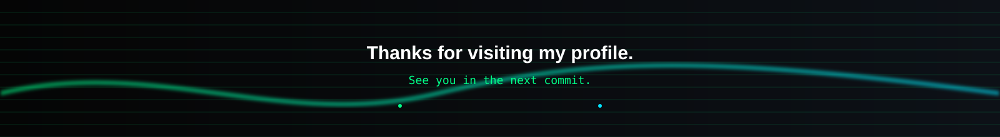

<!-- ===================================================== -->
<!--                  SOUMOJIT PAUL                         -->
<!--        Premium GitHub Profile - Version 3.0            -->
<!-- ===================================================== -->

<!-- ⚡ ANIMATED HERO BANNER -->
<p align="center">
  
</p>

<br>

<!-- 🎯 TYPING SVG HEADER & BADGES -->
<h1 align="center">
  
</h1>

<p align="center">
  
  
  
</p>

<p align="center">
  <a href="https://soumojitpaul.me">
    
  </a>
  <a href="mailto:psoumojit40@gmail.com">
    
  </a>
  <a href="https://www.linkedin.com/in/soumo09/">
    
  </a>
</p>

<br>

<!-- 🏆 GITHUB PROFILE TROPHIES -->
<p align="center">
  
</p>

<br>

<!-- 🪪 ABOUT ME & SWINGING LANYARD ID BADGE -->
<table>
<tr>
<td width="60%" valign="top">

# 👋 About Me

```diff
+ Full Stack Developer & UI Engineer
+ Passionate about immersive web experiences
+ Building modern products using React, Next.js and Three.js
+ Focused on 3D Web Graphics, Performance and Scalability
+ Always learning advanced frontend technologies
```

<br>

I’m **Soumojit Paul**, an MCA student at **Future Institute of Engineering and Management (FIEM)** and a passionate **Full Stack Developer** specializing in modern JavaScript &amp; 3D web technologies.

My primary focus is creating **premium digital experiences** using **React**, **Next.js**, **Three.js**, **Framer Motion**, and scalable backend services.

Currently, I'm exploring advanced **3D web graphics**, WebGL shaders, and interactive user experiences to push the boundaries of what can be achieved on the web.

<br>

<!-- 💻 CYBER TERMINAL STATUS -->
<p align="center">
  
</p>

</td>
<td width="40%" align="center" valign="middle">

<!-- 🪪 SWINGING LANYARD SVG -->


</td>
</tr>
</table>

---

# 🚀 Current Focus

<table>
<tr>
<td width="50%">

### 🌌 Building
- Premium Portfolio
- Interactive 3D Websites
- Enterprise Applications
- Full Stack Products

</td>
<td width="50%">

### 📚 Learning
- Advanced Three.js
- React Three Fiber
- WebGL &amp; GLSL Shaders
- GSAP &amp; Framer Motion

</td>
</tr>
</table>

---

# ⚡ Tech Arsenal

## 🎨 Frontend
<p>
  
</p>

---

## ⚙ Backend
<p>
  
</p>

---

## 🗄 Databases
<p>
  
</p>

---

## 🛠 Developer Tools
<p>
  
</p>

---

<p align="center">
  
</p>

# 🌟 Featured Projects

> Every project below focuses on solving real-world problems with modern technologies and polished user experiences.

<br>

<table>
<tr>
<td width="50%">

<h3 align="center">🌐 Developer Portfolio</h3>

<p align="center">
  <a href="https://soumojitpaul.me"></a>
  <a href="https://github.com/psoumojit40/Portfolio"></a>
</p>

<p>
A premium developer portfolio focused on immersive UI, interactive 3D animations and modern frontend engineering.
</p>

<p>
<strong>Tech Stack:</strong><br>
<code>React</code> • <code>Next.js</code> • <code>Three.js</code> • <code>Framer Motion</code> • <code>TailwindCSS</code>
</p>

</td>

<td width="50%">

<h3 align="center">⌚ Watch Brand Website</h3>

<p align="center">
  <a href="https://github.com/psoumojit40/watch-brand-website"></a>
</p>

<p>
Luxury watch showcase inspired by premium brands with cinematic transitions, immersive scrolling and 3D interactions.
</p>

<p>
<strong>Tech Stack:</strong><br>
<code>Next.js</code> • <code>React</code> • <code>Three.js</code> • <code>Framer Motion</code>
</p>

</td>
</tr>

<tr>
<td width="50%">

<h3 align="center">👕 ClosetBridge</h3>

<p align="center">
  <a href="https://github.com/psoumojit40/ClosetBridge"></a>
</p>

<p>
AI-powered donation platform connecting donors with NGOs using computer vision for clothing quality assessment.
</p>

<p>
<strong>Tech Stack:</strong><br>
<code>React</code> • <code>Node.js</code> • <code>MongoDB</code> • <code>InceptionV3</code>
</p>

</td>

<td width="50%">

<h3 align="center">🏢 Team Hub</h3>

<p align="center">
  <a href="https://github.com/psoumojit40/Team_HUB"></a>
</p>

<p>
Enterprise leave management platform featuring RBAC, secure authentication and AI-powered assistance.
</p>

<p>
<strong>Tech Stack:</strong><br>
<code>Next.js</code> • <code>TypeScript</code> • <code>Express</code> • <code>MongoDB</code>
</p>

</td>
</tr>
</table>

---

# 📊 GitHub Analytics

<p align="center">
  
  
</p>

<br>

<p align="center">
  
</p>

---

# 📈 Contribution Activity

<p align="center">
  
</p>

---

# 🐍 Contribution Snake

<p align="center">
  <picture>
    <source media="(prefers-color-scheme: dark)" srcset="https://raw.githubusercontent.com/psoumojit40/psoumojit40/output/github-contribution-grid-snake-dark.svg"/>
    <source media="(prefers-color-scheme: light)" srcset="https://raw.githubusercontent.com/psoumojit40/psoumojit40/output/github-contribution-grid-snake.svg"/>
    
  </picture>
</p>

---

# 💬 Daily Dev Quote

<p align="center">
  
</p>

---

# 💼 What I Love Building

✔ Premium Frontend Experiences  
✔ Interactive 3D Websites  
✔ Enterprise Full Stack Applications  
✔ Beautiful UI Systems  
✔ High Performance Interfaces  
✔ Developer Tools  
✔ AI Assisted Applications  

---

<p align="center">
  
</p>

# 🌱 Currently Learning

<table>
<tr>
<td width="33%" align="center">

### 🌌 3D Web
Three.js<br>
React Three Fiber<br>
WebGL<br>
GLSL

</td>
<td width="33%" align="center">

### ⚡ Frontend
Next.js<br>
Framer Motion<br>
GSAP<br>
Performance

</td>
<td width="33%" align="center">

### 🚀 Backend
Scalable APIs<br>
Authentication<br>
Redis<br>
PostgreSQL

</td>
</tr>
</table>

---

# 🏆 Developer Philosophy

> **I believe great software is not only functional—it should also be beautiful, intuitive, and memorable.**

Every project I build is guided by three principles:
- 🎨 Exceptional User Experience
- ⚡ High Performance
- 🧩 Clean & Maintainable Architecture

---

# 🎯 2026 Goals

- 🚀 Build production-grade SaaS applications
- 🌍 Contribute to Open Source projects
- 🌌 Master advanced Three.js and React Three Fiber
- 📈 Deepen expertise in scalable backend systems
- 🤝 Collaborate with developers worldwide

---

# ⚡ Beyond Coding

<table>
<tr>
<td align="center" width="33%">

🎮
### Gaming
I enjoy exploring story-driven games and creative worlds.

</td>
<td align="center" width="33%">

🎵
### Music
Music helps me stay focused while designing and developing.

</td>
<td align="center" width="33%">

🎌
### Anime
Inspired by great storytelling, creativity, and visual design.

</td>
</tr>
</table>

---

# 🤝 Let's Connect

<p align="center">
  <a href="https://soumojitpaul.me">
    
  </a>
  <a href="mailto:psoumojit40@gmail.com">
    
  </a>
  <a href="https://www.linkedin.com/in/soumo09/">
    
  </a>
  <a href="https://github.com/psoumojit40">
    
  </a>
</p>

---

<p align="center">
  <b>💬 Open to</b><br>
  Full Stack Development • Frontend Engineering • Open Source • Freelance • Collaborations
</p>

---

<p align="center">
  
</p>

<p align="center">
  
</p>

<h3 align="center">
  ✨ Thanks for visiting my profile ✨
</h3>

<p align="center">
  <i>"Crafting immersive digital experiences, one pixel at a time."</i>
</p>

<!-- =========================================================== -->
<!--                     END OF PROFILE                          -->
<!-- =========================================================== -->